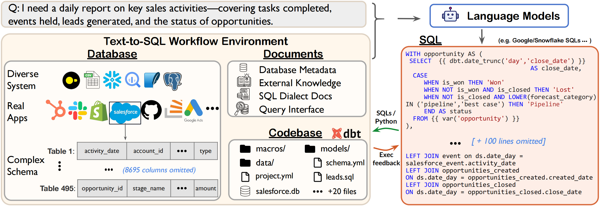

# Spider 2.0: Evaluating Language Models on Real-World Enterprise Text-to-SQL Workflows
<p align="center">
  <a href="https://spider2-sql.github.io/">Website</a> •
  <a href="https://arxiv.org/abs/2411.07763">Paper</a> •
  <a href="https://docs.google.com/document/d/1a69mxO7m1nMndXp8H_-aggvYDbcbiS3rV9GPXEw-DeM/edit?usp=sharing">Data Update Log</a> •
  <a href="https://docs.google.com/document/d/1sCobAqJZcko-Vl3biOycwvCIR7kTwBPrhsgVfvaX1Fg/edit?usp=sharing">Submission Guidance</a>
</p>

## 📰 News

- **2025-05-28**: If you think your database query speed is slow, please refer to [How to change snowflake compute WH](https://github.com/xlang-ai/Spider2/blob/main/assets/Snowflake-wh-change.md). 

- **2025-05-22**: We have created a new task setting, `Spider2-DBT`, and removed the original Spider2 setting. [spider2-dbt](https://github.com/xlang-ai/Spider2/tree/main/spider2-dbt) consists of only 68 tasks, enabling quick and smooth benchmarking with [spider-agent-dbt](https://github.com/xlang-ai/Spider2/tree/main/methods/spider-agent-dbt). It is a comprehensive, repository-level text-to-SQL task.

- **2025-04-20**: We provide the [ground-truth tables](https://github.com/xlang-ai/Spider2/tree/main/methods/gold-tables) for spider2-lite and spider2-snow to help quick benchmarking and analysis. However, when using this setting, you must indicate that you are using `oracle tables`.

- **2025-01-10**: Please refer to the [data update log](https://docs.google.com/document/d/1a69mxO7m1nMndXp8H_-aggvYDbcbiS3rV9GPXEw-DeM/edit?usp=sharing) to track changes in the evaluation examples. The [leaderboard](https://spider2-sql.github.io/) results will also change dynamically accordingly.

- **2025-01-07**: Please note that we do not recommend using the Spider 2.0 Gold SQL we released for SFT, as it may affect the fairness of evaluation and hinder better benchmarking of the model's SQL capabilities. The release of Gold SQL is intended to help users design prompts.

- **2024-12-26**: **Using Spider-Agent to benchmark your LLMs!** Considering the widespread attention to the traditional text-to-SQL setting, we now recommend using [spider-agent-lite](https://github.com/xlang-ai/Spider2/tree/main/methods/spider-agent-lite) and [spider-agent-snow](https://github.com/xlang-ai/Spider2/tree/main/methods/spider-agent-snow) to work with [spider2-lite](https://github.com/xlang-ai/Spider2/tree/main/spider2-lite/evaluation_suite) and [spider2-snow](https://github.com/xlang-ai/Spider2/tree/main/spider2-snow/evaluation_suite) for benchmarking your LLMs. The final output should be CSV files, not SQLs.

- **2024-12-24**: Considering the many evaluation requirements, we have decided to **release all examples and gold answers for self-evaluation**. However, only a small amount of gold SQL is available. The leaderboard is still active. To have your method officially validated and upload your scores to the leaderboard, please follow the [submission guidance](https://docs.google.com/document/d/1sCobAqJZcko-Vl3biOycwvCIR7kTwBPrhsgVfvaX1Fg/edit?usp=sharing).


## 🏆 Milestone

As of now, all methods combined can solve 63.8% (349/547) of the examples in Spider 2.0!


## 👋 Overview




<div style="width: 10%; margin: auto;">
  <table style="font-size: 12px; width: 100%;">
    <tr>
      <th>Setting</th>
      <th>Task Type</th>
      <th>#Examples</th>
      <th>Databases</th>
      <th>Cost</th>
    </tr>
    <tr>
      <td><strong>Spider 2.0-Snow</strong></td>
      <td>Text-to-SQL task</td>
      <td>547</td>
      <td>Snowflake(547)</td>
      <td><span style="color: red;">NO COST!😊</span></td>
    </tr>
    <tr>
      <td><strong>Spider 2.0-Lite</strong></td>
      <td>Text-to-SQL task</td>
      <td>547</td>
      <td>BigQuery(214), Snowflake(198), SQLite(135)</td>
      <td>Some cost incurred</td>
    </tr>
    <tr>
      <td><strong>Spider 2.0-DBT</strong></td>
      <td>Code agent task</td>
      <td>68</td>
      <td>DuckDB (DBT)(68)</td>
      <td>NO COST!😊</td>
    </tr>
  </table>
</div>


### Why Spider 2.0?

In 2018, we introduced [Spider 1.0](https://yale-lily.github.io/spider), [SParC](https://yale-lily.github.io/sparc), and [CoSQL](https://yale-lily.github.io/cosql) as part of the Yale Semantic Parsing and Text-to-SQL Challenge Series, attracting over 300 submissions from leading research labs worldwide.

Now, in the era of Large Language Models (LLMs), we present Spider 2.0 to advance code generation, particularly text-to-SQL capabilities.

This new benchmark offers a more realistic and challenging test of LLMs' performance on complex enterprise-level text-to-SQL workflows, involving complex data environments (e.g., >3000 columns), multiple SQL dialects (e.g., BigQuery, Snowflake), and diverse operations (e.g., transformation, analytics).

Notably, as shown below, even the most advanced LLMs, including GPT-4, solve only 6.0% of Spider 2.0 tasks, compared to 86.6% on Spider 1.0 and 57.4% on BIRD, highlighting the significant challenges posed by Spider 2.0.

|                 | Spider 1.0 dev | Spider 1.0 test | BIRD test | Spider 2.0-lite | Spider 2.0-snow |
| --------------- | -------------- | --------------- | --------- | --------------- | --------------- |
| DailSQL + GPT-4 | 82.4           | 86.6            | 57.4      | 5.6             | 2.2             |
| CodeS-15B       | 85.4           | -               | 59.3      | 0.7             | 0.0             |


### Data

The questions/instructions are in [spider2-lite.jsonl](https://github.com/xlang-ai/Spider2/blob/main/spider2-lite/spider2-lite.jsonl) and [spider2-snow.jsonl](https://github.com/xlang-ai/Spider2/blob/main/spider2-snow/spider2-snow.jsonl).

We also release some gold SQLs to help users design prompts and methods, **note that we do not recommend using the Spider 2.0 Gold SQL we released for fine-tuning**.

- [spider2-lite-goldSQL](https://github.com/xlang-ai/Spider2/tree/main/spider2-lite/evaluation_suite/gold/sql)
- [spider2-snow-goldSQL](https://github.com/xlang-ai/Spider2/tree/main/spider2-snow/evaluation_suite/gold/sql)


## 🚀 Quickstart (Spider2-lite/snow)

### Sign Up for Your Own BigQuery and Snowflake Accounts

1. To sign up for a BigQuery account, please follow this [guideline](https://github.com/xlang-ai/Spider2/blob/main/assets/Bigquery_Guideline.md), get your own credentials.

2. Follow this [guideline](https://github.com/xlang-ai/Spider2/blob/main/assets/Snowflake_Guideline.md) and fill out this [Spider2 Snowflake Access](https://docs.google.com/forms/d/e/1FAIpQLScbVIYcBkADVr-NcYm9fLMhlxR7zBAzg-jaew1VNRj6B8yD3Q/viewform?usp=sf_link), and we will send you an account sign-up email, which will allow you to access the Snowflake database.

**Important Notes:**

- If you want to access the **FULL dataset** of Spider 2.0-Lite, you must complete **Step1** and **Step2**.

- If you only want access to the **FULL dataset** of Spider 2.0-Snow, you only need to complete **Step2**.


### Spider 2.0-Snow and Spider 2.0-Lite (UPDATE 2024-12-26)

**We highly recommend that you directly use Spider2-snow and Spider2-lite for benchmarking and research. First, run the Spider-Agent Framework!!**

For more details, please refer to the following links:

- [spider-agent-lite](https://github.com/xlang-ai/Spider2/tree/main/methods/spider-agent-lite)
- [spider-agent-snow](https://github.com/xlang-ai/Spider2/tree/main/methods/spider-agent-snow)


## 🚀 Quickstart (Spider2-dbt)

For more details, please refer to the following links:

- [spider2-dbt](https://github.com/xlang-ai/Spider2/tree/main/spider2-dbt) (The Data)
- [spider-agent-dbt](https://github.com/xlang-ai/Spider2/tree/main/methods/spider-agent-dbt) (The Method)


# 📋 Leaderboard Submission 

We only release the gold answer of about partial examples of Spider 2.0-Lite, Spider 2.0-Snow and Spider 2.0-DBT.
You must follow this [submission guidance](https://docs.google.com/document/d/1sCobAqJZcko-Vl3biOycwvCIR7kTwBPrhsgVfvaX1Fg/edit?usp=sharing) to upload your score to [leaderboard](https://spider2-sql.github.io/).


# 🙇‍♂️ Acknowledgement

We thank Snowflake for their generous support in hosting the Spider 2.0 Challenge.
We also thank Minghang Deng, Tianbao Xie, Yiheng Xu, Fan Zhou, Yuting Lan, Per Jacobsson, Yiming Huang, Canwen Xu, Zhewei Yao, and Binyuan Hui for their helpful feedback on this work.
The website and submission guidelines are greatly inspired by [BIRD-SQL](https://bird-bench.github.io/), and we thank them for their contributions.

<p align="center">
  
</p>


# ✍️ Citation
If you find our work helpful, please cite as
```
@misc{lei2024spider2,
      title={Spider 2.0: Evaluating Language Models on Real-World Enterprise Text-to-SQL Workflows}, 
      author={Fangyu Lei and Jixuan Chen and Yuxiao Ye and Ruisheng Cao and Dongchan Shin and Hongjin Su and Zhaoqing Suo and Hongcheng Gao and Wenjing Hu and Pengcheng Yin and Victor Zhong and Caiming Xiong and Ruoxi Sun and Qian Liu and Sida Wang and Tao Yu},
      year={2024},
      eprint={2411.07763},
      archivePrefix={arXiv},
      primaryClass={cs.CL},
      url={https://arxiv.org/abs/2411.07763}, 
}
```
