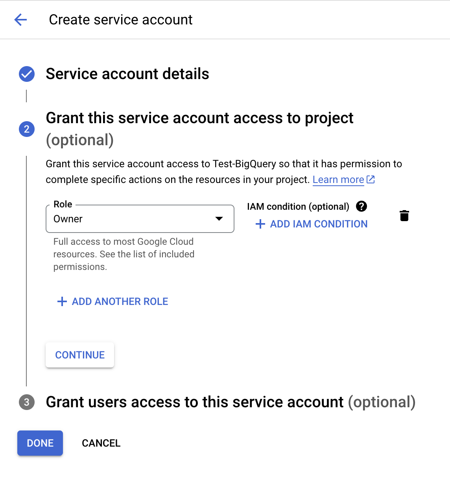

# BigQuery Guideline

A large quantities of databases in Spider2 are stored in BigQuery, including industrial-level databases that reach TB-level. To evaluate on our benchmark, you need to:

1. Register a BigQuery account and enable the BigQuery Sandbox function;
> 🌹 You can get access to 70% SQLs of our benchmark, which query open-sourced databases in public Google Cloud Project `bigquery-public-data`.


If you are a beginner to BigQuery, please follow the guidelines below. We will walk you through

- [BigQuery Guideline](#bigquery-guideline)
  - [How to Enable BigQuery Sandbox](#how-to-enable-bigquery-sandbox)
  - [How to Check BigQuery Public Databases](#how-to-check-bigquery-public-databases)
  - [How to Get BigQuery Credential](#how-to-get-bigquery-credential)

as well as

- [How to Get Access to `spider2-public-data`](#how-to-get-access-to-spider2-public-data).


## How to Enable BigQuery Sandbox

First of all, you need to enable BigQuery Sandbox function for your Google account. This part is summarized from the [official tutorial](https://cloud.google.com/bigquery/docs/sandbox).

1. In the Google Cloud console, go to the [**BigQuery**](https://console.cloud.google.com/bigquery
) page.

```txt
https://console.cloud.google.com/bigquery
```

The Google Cloud console is the graphical interface that you use to create and manage BigQuery resources and to run SQL queries.

2. Authenticate with your Google Account, or create a new one.

3. Click button `Select a project` on the top menu bar to select one Google Cloud Project (GCP).

<p align="center">
  
</p>

4. [Optional] If you do not have a GCP currently, create a new one. On the **New Project** page, do the following:
    - For **Project name**, enter a name for your project.
    - For **Organization**, keep the default `No organization` if you are not part of one.
    - Click **Create**. You are redirected back to the BigQuery page in the Google Cloud console.

<p align="center">
  
</p>

5. Then, you have successfully created a new GCP and enable the BigQuery Sandbox function.

<p align="center">
  
</p>


## How to Check BigQuery Public Databases

About 70% of SQLs in Spider2 are contained in bigquery public projects, which contains a large quantities of freely accessed databases, e.g., `bigquery-public-data.new_york`. To view the schema/content of these open-sourced databases and run trial SQLs on them, you can **star** the `bigquery-public-data` on your left panel (based on [official tutorial](https://cloud.google.com/bigquery/docs/bigquery-web-ui#:~:text=Star%20a%20project,-You%20can%20star&text=If%20you%20have%20access%20to,that%20you%20want%20to%20star.)). Concretely,

1. In the **Explorer** pane, click the button `➕ ADD`.

2. Next, in the pop-up right dialog, click the row `🔍 Star a project by name`.

<p align="center">
  
</p>

3. Type in `bigquery-public-data` in the small pop-up dialog.

4. Then, you are able to view the database schema or run sample SQLs to query the database in project `bigquery-public-data`.

<p align="center">
  
  
</p>


## How to Get BigQuery Credential

If you want to access `bigquery-public-data` in a more elegant way, that is _using programming, API or command line interface (CLI)_, you need to set up the BigQuery credential. Typically, there are three different credential types, and we suggest using `Service Account`. Here is a step-by-step tutorial on how to get service account credentials based on [official link](https://developers.google.com/workspace/guides/create-credentials):

1. Go to [Service Account](https://console.cloud.google.com/iam-admin/serviceaccounts) page in the Google Cloud console (select the GCP previously created that you want to access through the credentials).

```txt
https://console.cloud.google.com/iam-admin/serviceaccounts
```

2. Click the button `➕ CREATE SERVICE ACCOUNT` on the top menu bar.


3. Fill in the service account details, then click the button `CREATE AND CONTINUE`.

> 🔥 You can type any service account name, the globally unique service account ID will be automatically generated.

4. Click the button `CONTINUE`, just skipping this step and use the default role `Owner`.

5. Click the button `DONE`, just leaving the two input boxes empty.

<p align="center">
  
  
  
</p>

6. Next, you will come back to the service account page. Click the three vertical dots icon `⋮` in the same row of your created service account and choose option `Manage keys`.

7. In the new page, click the button `ADD KEY`, use the default `JSON` format, and click `CREATE`. The key file (which is named as `{your_service_account}-xxxx.json`) will be automatically downloaded.

<p align="center">
  
  
</p>

8. Now, you can access your GCP using the downloaded service account credentials (`.json` file). For example, with [Python libraries](https://cloud.google.com/bigquery/docs/reference/libraries#client-libraries-install-python):

> Firstly, please install necessary libraries: `pip install --upgrade google-cloud-bigquery google-api-core`.

```python
from google.oauth2 import service_account
from google.cloud import bigquery

credential_path = 'service_account.json' # path/to/your/keyfile.json
credentials = service_account.Credentials.from_service_account_file(credential_path)
client = bigquery.Client(credentials=credentials)

# alternatively, you can also set the credential path via environment vairable
# import os
# os.environ['GOOGLE_APPLICATION_CREDENTIALS'] = "/path/to/keyfile.json"
# client = bigquery.Client()

# Perform a sample query.
sql_query = 'SELECT name FROM `bigquery-public-data.usa_names.usa_1910_2013` WHERE state = "TX" LIMIT 10'
query_job = client.query(sql_query)  # API request
rows = query_job.result()  # Waits for query to finish

for row in rows:
    print(row.name)
```
