# ✅ **Snowflake Access Guideline (Updated for MFA)**

### 1. Request Access

Please fill out this form:
[https://docs.google.com/forms/d/e/1FAIpQLScbVIYcBkADVr-NcYm9fLMhlxR7zBAzg-jaew1VNRj6B8yD3Q/viewform?usp=sf_link](https://docs.google.com/forms/d/e/1FAIpQLScbVIYcBkADVr-NcYm9fLMhlxR7zBAzg-jaew1VNRj6B8yD3Q/viewform?usp=sf_link)

Be sure to include:

* **Username** (your Snowflake username request)
* **Email** (must be valid; Snowflake will send you a setup link)

We will create your account **within 12 hours** and send your initial password via email.

---

### 2. Log into Snowflake

Click the link to access the Spider 2.0 Snowflake environment:

[https://app.snowflake.com/rsrsbdk/ydb67606/#/homepage](https://app.snowflake.com/rsrsbdk/ydb67606/#/homepage)

You will see a login screen:

<p align="center">
  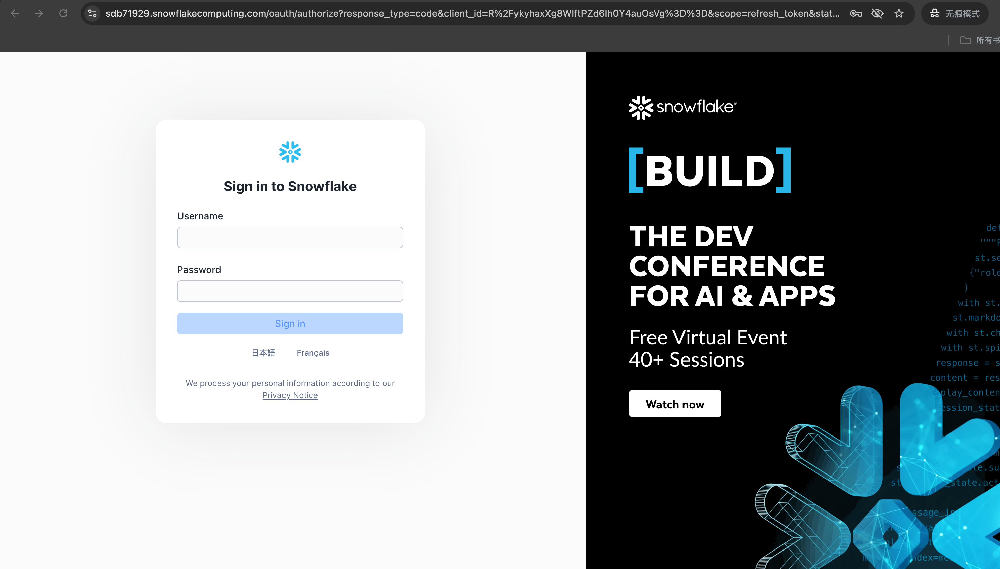
</p>

Enter your username and password

<p align="center">
  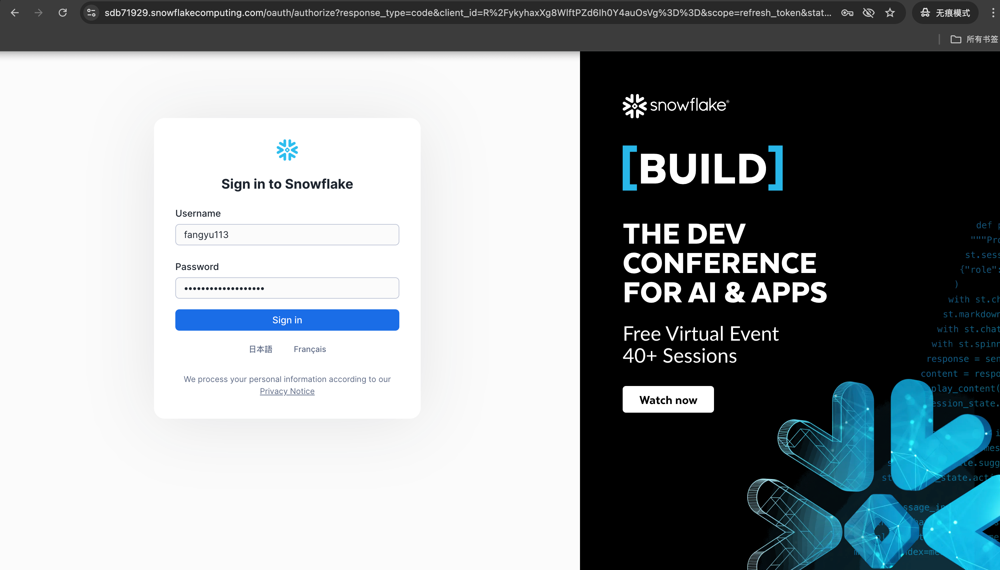
</p>


### 3. **Set Up MFA (Important — Choose Authenticator)**

After resetting your password, Snowflake will require MFA enrollment.

When prompted with **“Set up MFA”**, please select:

> **Authenticator** (NOT Passkey)


Then:

1. Open **Google Authenticator** on your phone
   (Download if needed: iOS/Android — free)
2. Tap **+** → **Scan QR code**
3. Scan the QR code on Snowflake
4. Enter the 6-digit code to finish setup

This only needs to be done **once**.

> ✅ If you accidentally clicked Passkey → use **Incognito/Private Window** and log in again to see **Authenticator**.

<p align="center">
  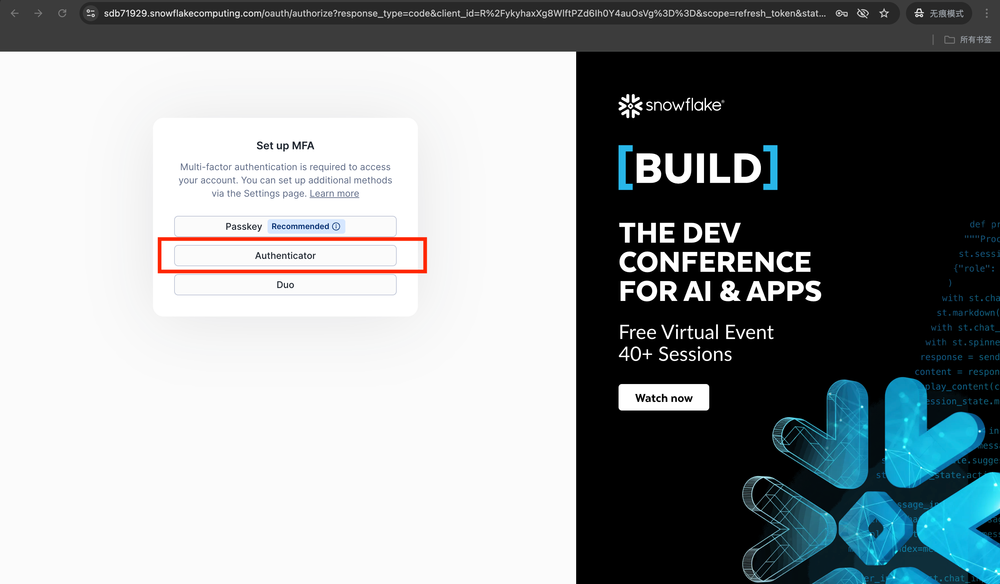
</p>

<p align="center">
  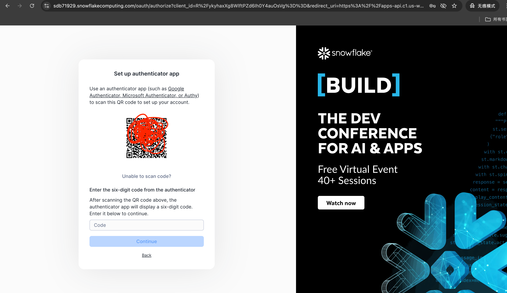
</p>

<p align="center">
  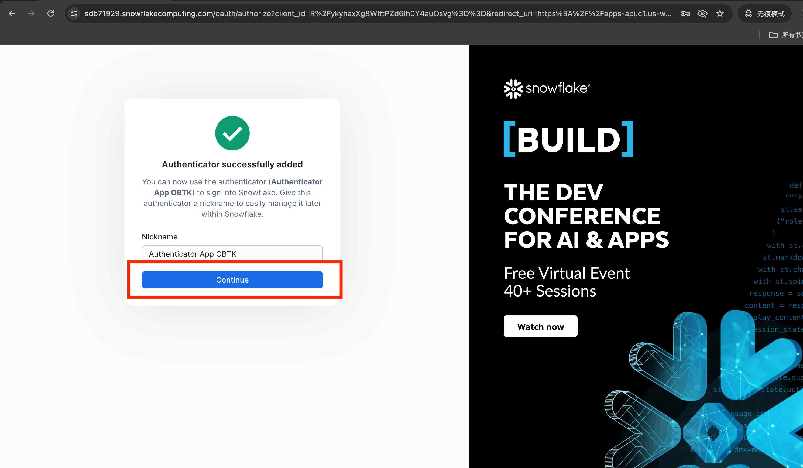
</p>


### 4. Reset your password

<p align="center">
  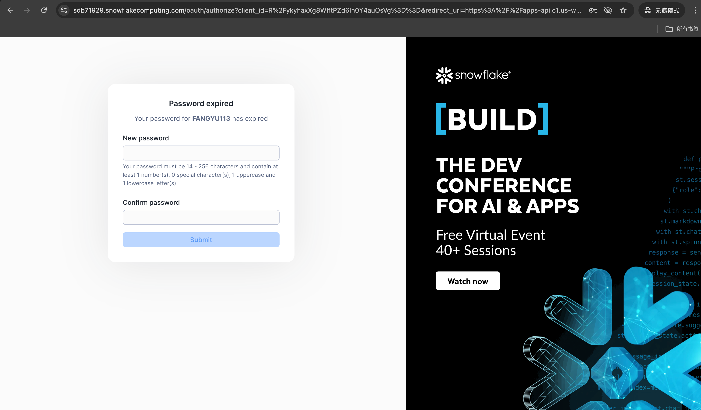
</p>


### 5. Successful Login


check the databases


<p align="center">
  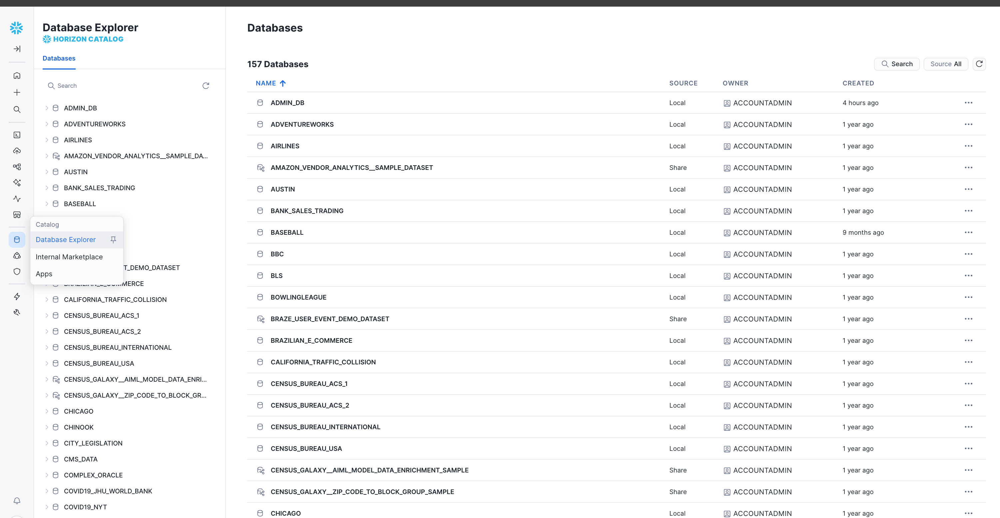
</p>


<p align="center">
  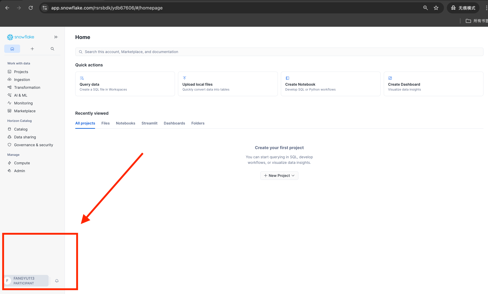
</p>


------------
If you **only use Snowflake via the web UI, stop here.**  
If you use Python / evaluation code, continue.


### 6. Using Snowflake in Spider2 / Spider2-Lite / Spider2-Snow (MOST IMPORTANT!)

Update your **`snowflake_credential.json`**:

```json
{
  "username": "<your_username>",
  "password": "<your_generated_token>",
  "account": "RSRSBDK-YDB67606",
  "role": "PARTICIPANT",
  "warehouse": "COMPUTE_WH_PARTICIPANT"
}
```

Only the **username** and **password** need to be changed.


<p align="center">
  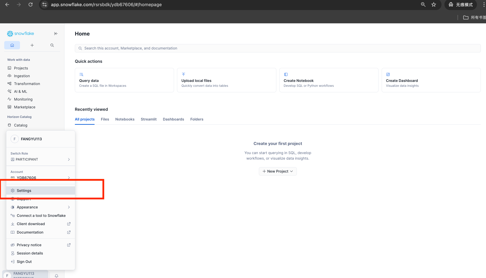
</p>

<p align="center">
  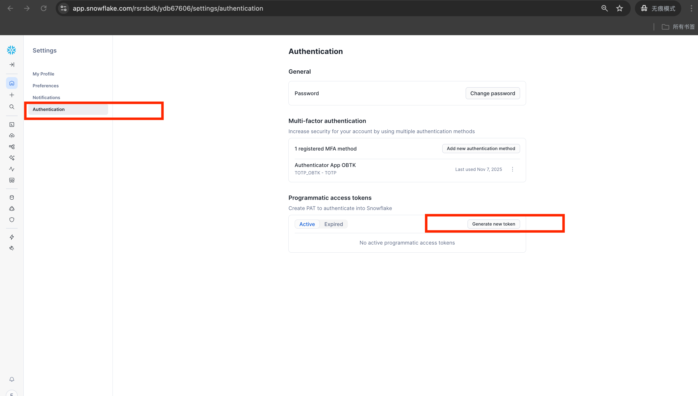
</p>

<p align="center">
  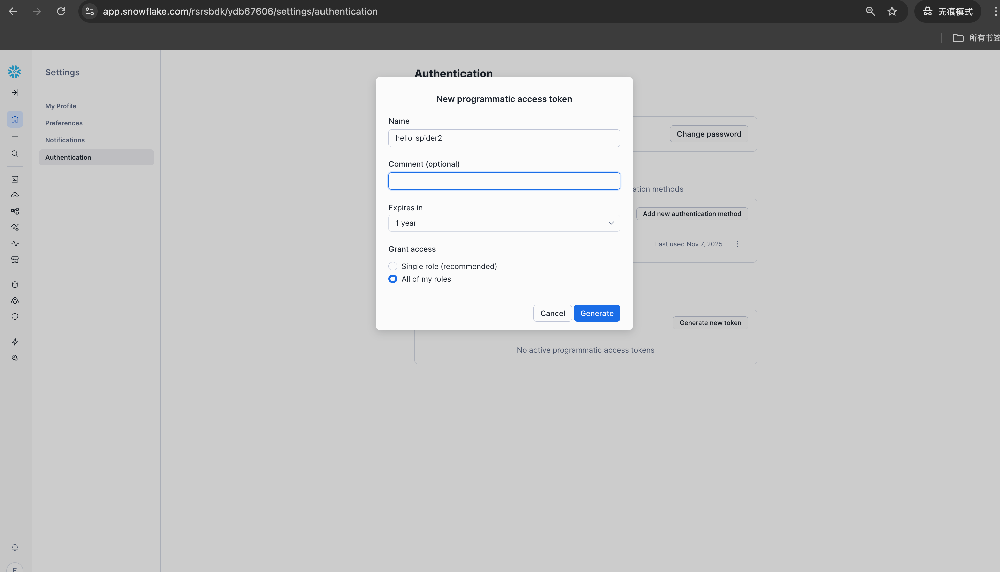
</p>

<p align="center">
  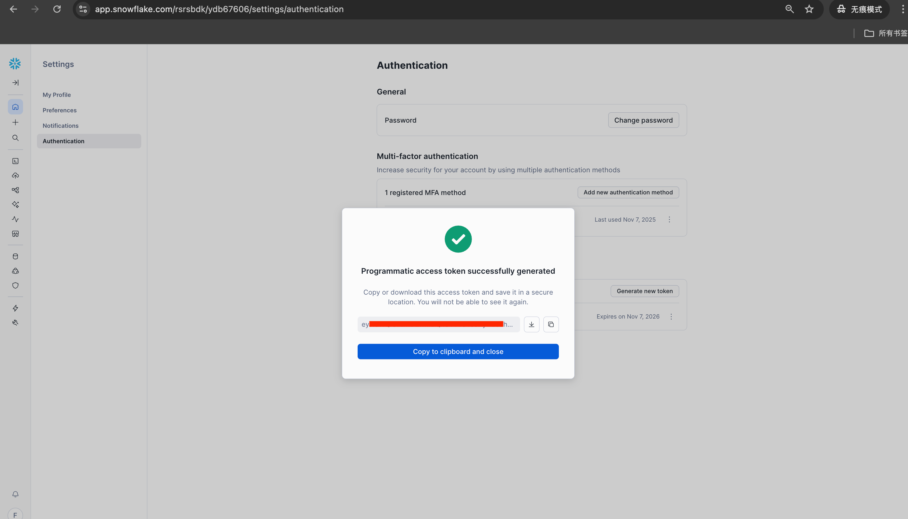
</p>

<p align="center">
  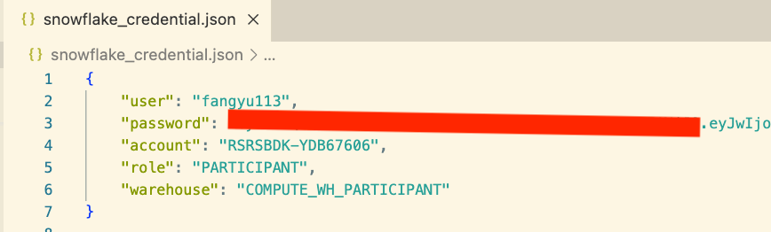
</p>


