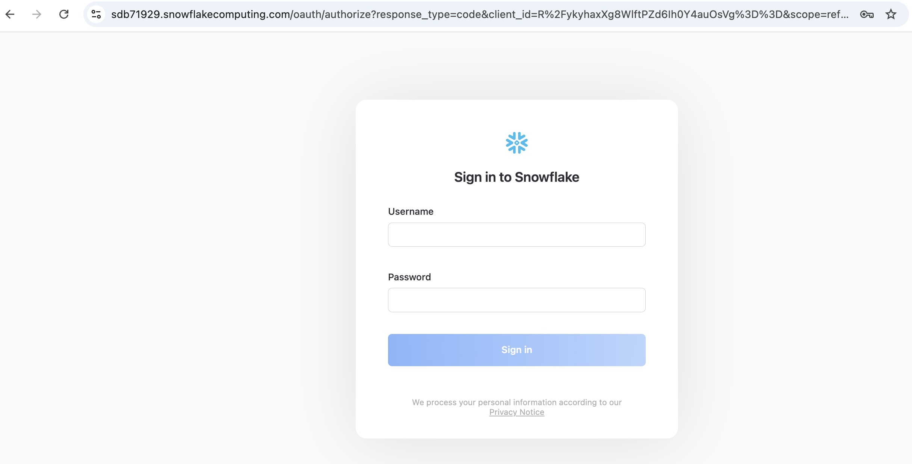
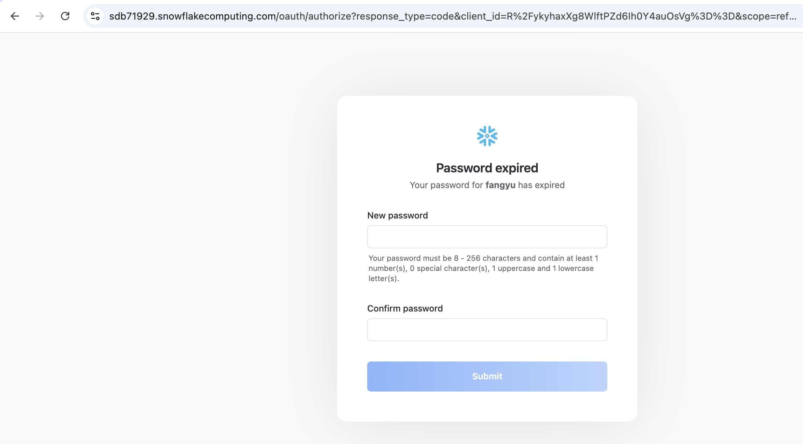
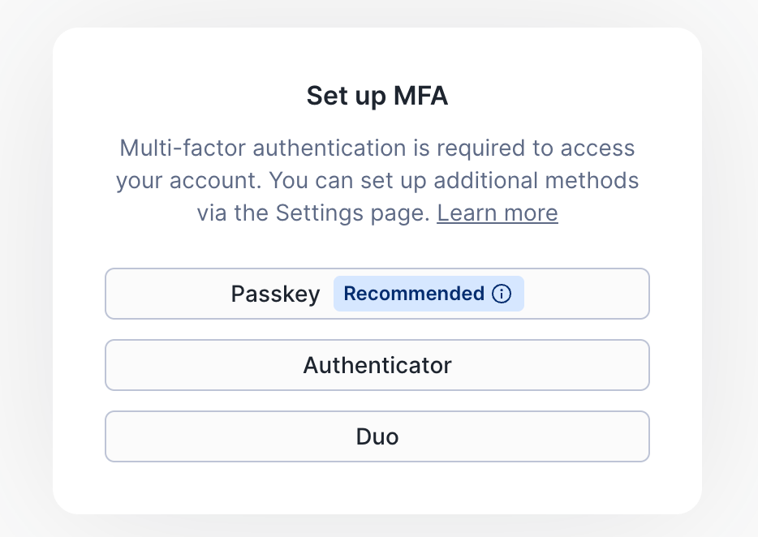
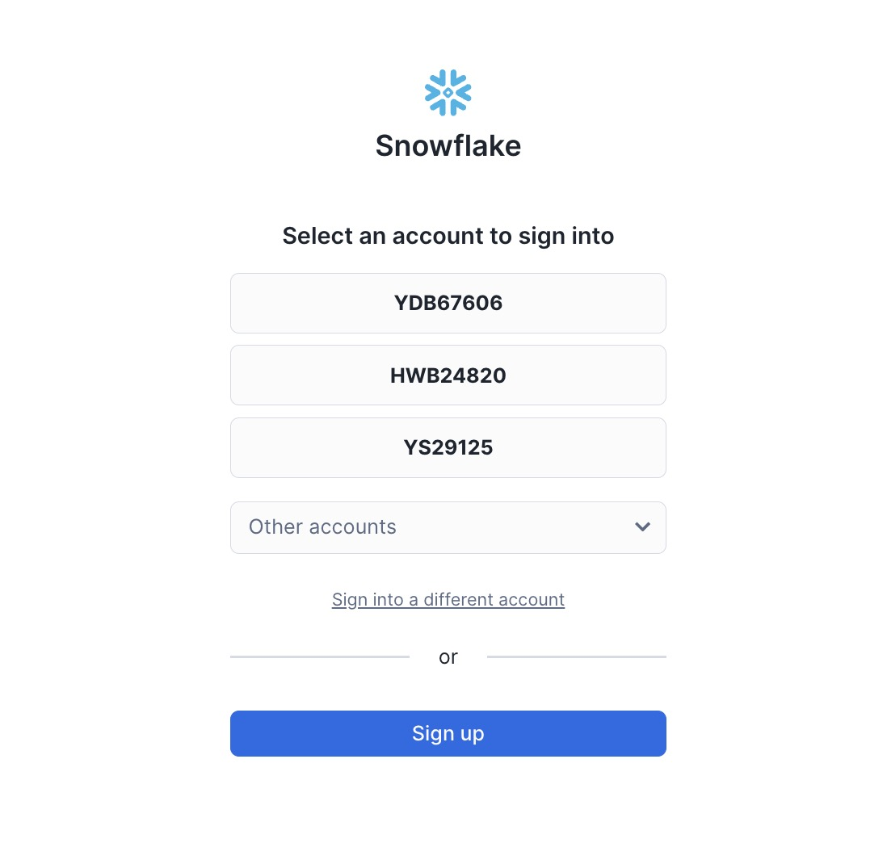
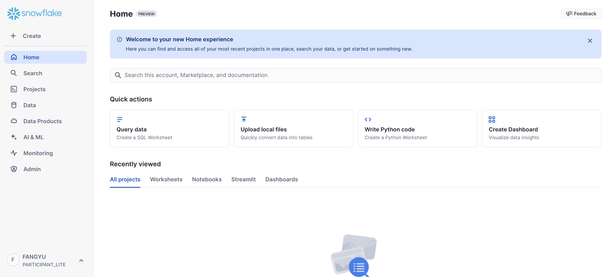
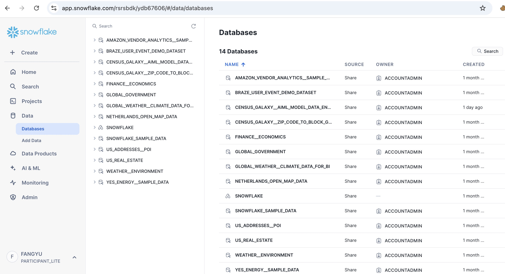

# ✅ **Snowflake Access Guideline (Updated for MFA)**

### 1. Request Access

Please fill out this form:
[https://docs.google.com/forms/d/e/1FAIpQLScbVIYcBkADVr-NcYm9fLMhlxR7zBAzg-jaew1VNRj6B8yD3Q/viewform?usp=sf_link](https://docs.google.com/forms/d/e/1FAIpQLScbVIYcBkADVr-NcYm9fLMhlxR7zBAzg-jaew1VNRj6B8yD3Q/viewform?usp=sf_link)

Be sure to include:

* **Username** (your Snowflake username request)
* **Email** (must be valid; Snowflake will send you a setup link)

We will create your account **within 12 hours** and send your initial password via email.

---

### 2. Log into Snowflake

Click the link to access the Spider 2.0 Snowflake environment:

[https://app.snowflake.com/rsrsbdk/ydb67606/#/homepage](https://app.snowflake.com/rsrsbdk/ydb67606/#/homepage)

You will see a login screen:

<p align="center">
  
</p>

Enter the **username** and **temporary password** we emailed to you.

---

### 3. Reset Your Password

On first login, you must reset your password:

<p align="center">
  
</p>

---

### 4. **Set Up MFA (Important — Choose Authenticator)**

After resetting your password, Snowflake will require MFA enrollment.

When prompted with **“Set up MFA”**, please select:

> **Authenticator** (NOT Passkey)

<p align="center">
  
</p>

Then:

1. Open **Google Authenticator** on your phone
   (Download if needed: iOS/Android — free)
2. Tap **+** → **Scan QR code**
3. Scan the QR code on Snowflake
4. Enter the 6-digit code to finish setup

This only needs to be done **once**.

> ✅ If you accidentally clicked Passkey → use **Incognito/Private Window** and log in again to see **Authenticator**.

---

### 5. Select Snowflake Account

If you see this page, choose:

**`YDB67606`**

<p align="center">
  
</p>

---

### 6. Successful Login

You should now be inside Snowflake:

<p align="center">
  
</p>

---

### 7. Viewing Data

Click **Data** in the left panel to see the available databases and tables:

<p align="center">
  
</p>

---

### 8. Using Snowflake in Spider2 / Spider2-Lite / Spider2-Snow

Update your **`snowflake_credential.json`**:

```json
{
  "username": "<your_username>",
  "password": "<your_new_password>",
  "account": "rsrsbdk.ydb67606",
  "warehouse": "<your_assigned_warehouse>",
  "role": "<your_assigned_role>"
}
```

Only the **username** and **password** need to be changed.

---

### 9. If You Change Phones or Need Help

If you need to reset MFA, simply contact us — we can reissue your MFA enrollment link within seconds.

---

# ✅ Done.

You’re fully set up.
Welcome to the Spider 2.0 Snowflake warehouse 🎉
